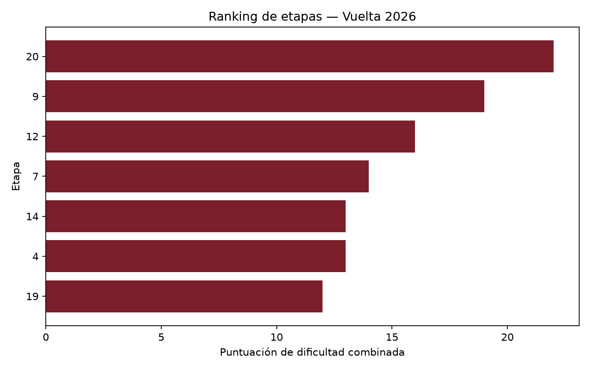

# Vuelta 2026 — ¿Dónde se decide la general?

**Nivel:** estudiante universitario, primer proyecto de análisis de datos, hecho antes de
empezar la carrera de Ciencia de Datos.
**Pregunta:** combinando categoría de puerto, dureza previa y cercanía a meta, ¿qué etapa
de montaña tiene más papeletas para decidir la Vuelta 2026?
## Datos
51 puertos de montaña con kilómetro oficial de paso y categoría, extraídos de la ficha
técnica publicada por la organización.
## Cómo lo calculé
Índice propio que combina: categoría del puerto final, dureza acumulada de los puertos
previos, cercanía a meta del último puerto intermedio y semana de carrera.
## Conclusión
La etapa 20 se perfila como la jornada decisiva de La Vuelta 2026 tras registrar 22 puntos en mi índice de impacto, por encima de los finales en puerto Especial de la etapa 9 en Aitana (19 puntos) y la etapa 12 en Calar Alto (16 puntos).

El análisis del recorrido demuestra que la capacidad de un puerto para marcar diferencias insalvables no depende solo de sus métricas aisladas, sino del contexto de la etapa y la altura de la carrera en la que se ubica:

Desnivel positivo encadenado (El factor purga): A diferencia de las etapas 9 y 12, donde la dureza se concentra en la ascensión final, la etapa 20 incluye un doble paso por El Purche y Hazallanas antes de afrontar el Collado del Alguacil. Este desgaste acumulado (con un elevado desnivel positivo en pocos kilómetros) elimina la efectividad del bloque de los equipos, aislando a los líderes antes de la última subida y transformando la carrera en un mano a mano por puro consumo energético.

Agotamiento metabólico en la Penúltima Jornada: La etapa 20 se disputa con más de 3.000 km en las piernas. A estas alturas de una gran vuelta, el margen de recuperación glucogénica es mínimo. Un desfallecimiento en la semana 1 cuesta segundos; en la semana 3, con la fatiga sistémica al límite, se mide en minutos.

Dinámica de carrera desinhibida: Si la clasificación general llega apretada, el penúltimo día elimina la necesidad de conservar fuerzas. La necesidad táctica de atacar desde lejos en el encadenado previo al Alguacil aumenta las probabilidades de que la carrera salte por los aires.

Nota metodológica: Este análisis surge de un índice de elaboración propia que pondera desnivel acumulado, dureza de los puertos previos, pendiente media del puerto final y momento en el calendario. No es un modelo predictivo validado estadísticamente, sino una herramienta de análisis táctico. La carretera dictará sentencia el 12 de septiembre de 2026.
*Nota: el índice usa pesos elegidos por mí, no un modelo estadístico validado — es un
ejercicio de análisis, no una predicción profesional.*

